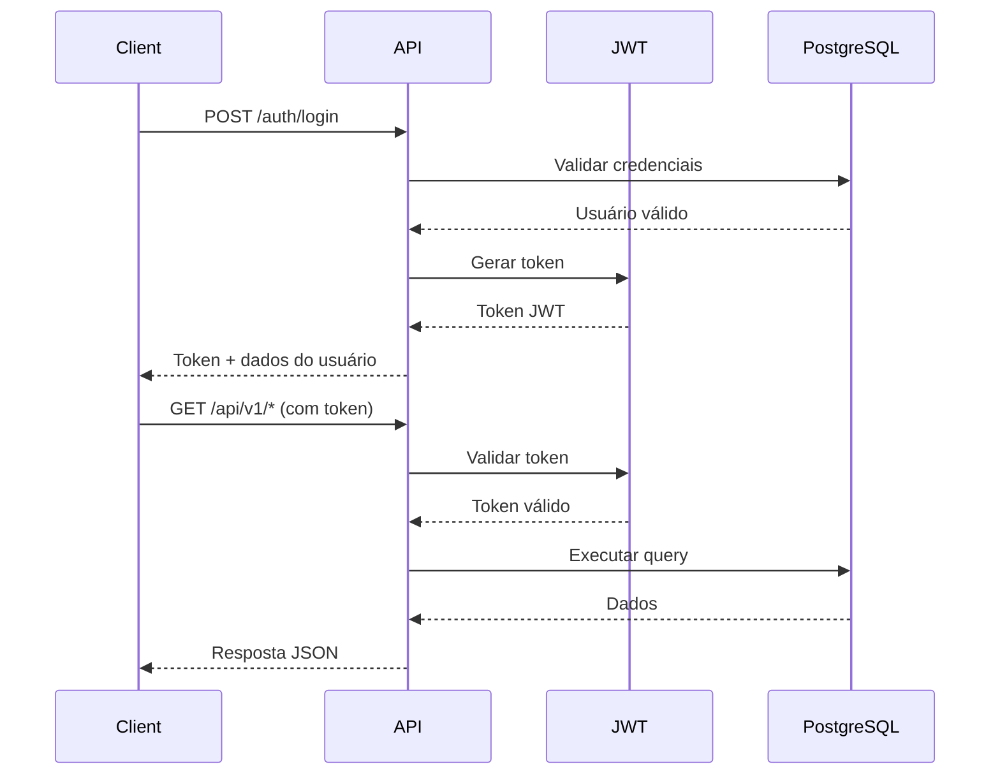

# 🚀 PG Analytics API

[](https://www.docker.com/)
[](https://golang.org/)
[](https://www.postgresql.org/)
[](https://jwt.io/)
[](https://swagger.io/)

**API REST moderna para análise e monitoramento de PostgreSQL com autenticação JWT, métricas em tempo real e documentação interativa.**

## 📋 Índice

- [🎯 Visão Geral](#-visão-geral)
- [✨ Funcionalidades](#-funcionalidades)
- [🏗️ Arquitetura](#️-arquitetura)
- [🚀 Quick Start](#-quick-start)
- [🔐 Autenticação](#-autenticação)
- [📊 Endpoints](#-endpoints)
- [📖 Documentação](#-documentação)
- [🐳 Docker](#-docker)
- [⚙️ Configuração](#️-configuração)
- [🧪 Testes](#-testes)
- [📈 Monitoramento](#-monitoramento)
- [🛠️ Desenvolvimento](#️-desenvolvimento)
- [🔧 Troubleshooting](#-troubleshooting)
- [📝 Licença](#-licença)

## 🎯 Visão Geral

O **PG Analytics API** é uma solução completa para monitoramento e análise de bancos de dados PostgreSQL, oferecendo:

- **🔐 Autenticação JWT** robusta e segura
- **📊 Métricas em tempo real** do PostgreSQL
- **📖 Documentação Swagger** interativa
- **🐳 Deploy Docker** simplificado
- **🏗️ Arquitetura modular** e escalável
- **⚡ Performance otimizada** para produção

## ✨ Funcionalidades

### 🔒 Segurança
- [x] Autenticação JWT
- [x] Middleware de autorização
- [x] Tokens com expiração configurável
- [x] Validation de requests

### 📊 Analytics PostgreSQL
- [x] **Slow Queries** - Consultas lentas com métricas
- [x] **Table Statistics** - Estatísticas detalhadas de tabelas
- [x] **Connections Monitor** - Monitoramento de conexões ativas
- [x] **Performance Metrics** - Métricas de desempenho do banco

### 📖 Documentação
- [x] **Swagger UI** interativo
- [x] **OpenAPI 3.0** specification
- [x] **Examples** e schemas completos
- [x] **Try it out** direto na interface

### 🛠️ DevOps
- [x] **Docker Compose** para desenvolvimento
- [x] **Multi-stage builds** otimizados
- [x] **Health checks** automáticos
- [x] **Logging estruturado**

## 🏗️ Arquitetura

```
pganalytics-v2/
├── cmd/server/           # Entry point da aplicação
├── internal/
│   ├── handlers/         # HTTP handlers
│   ├── middleware/       # Middlewares (auth, CORS, etc)
│   ├── models/          # Estruturas de dados
│   └── services/        # Lógica de negócio
├── migrations/          # Migrações do banco
├── docs/               # Documentação Swagger gerada
├── docker-compose.yml  # Configuração Docker
└── Dockerfile         # Build da aplicação
```

### 🔄 Fluxo de Autenticação



## 🚀 Quick Start

### Pré-requisitos
- [Docker](https://www.docker.com/) 20.10+
- [Docker Compose](https://docs.docker.com/compose/) 2.0+

### 1. Clone o repositório
```bash
git clone https://github.com/your-repo/pganalytics-v2.git
cd pganalytics-v2
```

### 2. Inicie o ambiente
```bash
# Iniciar containers
docker-compose up -d

# Verificar status
docker-compose ps
```

### 3. Verifique se está funcionando
```bash
# Health check
curl http://localhost:8080/health

# Resposta esperada:
# {"status":"healthy","message":"PG Analytics API funcionando",...}
```

### 4. Acesse a documentação
🌐 **Swagger UI:** http://localhost:8080/swagger/index.html

## 🔐 Autenticação

### Login

**Endpoint:** `POST /auth/login`

**Request:**
```json
{
  "username": "admin@pganalytics.local",
  "password": "admin123"
}
```

**Response:**
```json
{
  "token": "eyJhbGciOiJIUzI1NiIsInR5cCI6IkpXVCJ9...",
  "expires_in": 86400,
  "user": "admin@pganalytics.local"
}
```

### Credenciais Disponíveis

| Username | Password | Role |
|----------|----------|------|
| `admin@pganalytics.local` | `admin123` | admin |
| `admin` | `admin123` | admin |
| `user` | `admin123` | user |

### Usando o Token

Inclua o token JWT no header `Authorization`:

```bash
curl -H "Authorization: Bearer YOUR_TOKEN" \
     http://localhost:8080/api/v1/auth/profile
```

## 📊 Endpoints

### 🔓 Públicos

| Method | Endpoint | Descrição |
|--------|----------|-----------|
| `GET` | `/health` | Health check da API |
| `POST` | `/auth/login` | Autenticação de usuário |
| `GET` | `/swagger/*` | Documentação Swagger |

### 🔒 Protegidos (requer token JWT)

| Method | Endpoint | Descrição |
|--------|----------|-----------|
| `GET` | `/api/v1/auth/profile` | Perfil do usuário autenticado |
| `GET` | `/api/v1/analytics/queries/slow` | Consultas lentas do PostgreSQL |
| `GET` | `/api/v1/analytics/tables/stats` | Estatísticas das tabelas |
| `GET` | `/api/v1/analytics/connections` | Conexões ativas no banco |
| `GET` | `/api/v1/analytics/performance` | Métricas de performance |
| `GET` | `/metrics` | Métricas da aplicação |

### 📋 Exemplos de Uso

#### 1. Fazer Login
```bash
curl -X POST http://localhost:8080/auth/login \
  -H "Content-Type: application/json" \
  -d '{"username":"admin@pganalytics.local","password":"admin123"}'
```

#### 2. Obter Slow Queries
```bash
curl -H "Authorization: Bearer YOUR_TOKEN" \
     http://localhost:8080/api/v1/analytics/queries/slow
```

#### 3. Verificar Connections
```bash
curl -H "Authorization: Bearer YOUR_TOKEN" \
     http://localhost:8080/api/v1/analytics/connections
```

## 📖 Documentação

### Swagger UI

A documentação interativa está disponível em:
🌐 **http://localhost:8080/swagger/index.html**

Funcionalidades do Swagger:
- ✅ **Try it out** - Teste direto na interface
- ✅ **Schemas** - Estruturas de dados detalhadas
- ✅ **Examples** - Exemplos de requests/responses
- ✅ **Authentication** - Teste com JWT tokens

### Regenerar Documentação

```bash
# Instalar swag (se necessário)
go install github.com/swaggo/swag/cmd/swag@latest

# Gerar docs
swag init -g cmd/server/main.go -o ./docs
```

## 🐳 Docker

### Comandos Úteis

```bash
# Iniciar ambiente completo
docker-compose up -d

# Parar containers
docker-compose down

# Rebuild (após mudanças no código)
docker-compose build --no-cache

# Ver logs
docker-compose logs -f api

# Acessar container da API
docker-compose exec api sh

# Acessar PostgreSQL
docker-compose exec postgres psql -U postgres -d pganalytics
```

### Estrutura dos Containers

| Container | Porta | Descrição |
|-----------|-------|-----------|
| `pganalytics-api` | 8080 | API principal |
| `pganalytics-postgres` | 5432 | Banco PostgreSQL |

## ⚙️ Configuração

### Variáveis de Ambiente

| Variável | Padrão | Descrição |
|----------|--------|-----------|
| `PORT` | `8080` | Porta da API |
| `GIN_MODE` | `debug` | Modo do Gin (debug/release) |
| `DB_HOST` | `postgres` | Host do PostgreSQL |
| `DB_PORT` | `5432` | Porta do PostgreSQL |
| `DB_USER` | `postgres` | Usuário do banco |
| `DB_PASSWORD` | `postgres` | Senha do banco |
| `DB_NAME` | `pganalytics` | Nome do banco |
| `JWT_SECRET` | `your-secret-key-2024` | Chave secreta JWT |

### Arquivo .env

Crie um arquivo `.env` baseado no `.env.example`:

```bash
cp .env.example .env
# Edite conforme necessário
```

## 🧪 Testes

### Teste Rápido do Sistema

```bash
# Executar todos os testes
bash quick_validation.sh
```

### Testes Manuais

```bash
# 1. Health Check
curl http://localhost:8080/health

# 2. Login
TOKEN=$(curl -s -X POST http://localhost:8080/auth/login \
  -H "Content-Type: application/json" \
  -d '{"username":"admin@pganalytics.local","password":"admin123"}' \
  | jq -r '.token')

# 3. Endpoint protegido
curl -H "Authorization: Bearer $TOKEN" \
     http://localhost:8080/api/v1/auth/profile

# 4. Analytics
curl -H "Authorization: Bearer $TOKEN" \
     http://localhost:8080/api/v1/analytics/queries/slow
```

### Validação de Endpoints

| Endpoint | Status Esperado | Descrição |
|----------|----------------|-----------|
| `/health` | 200 | Deve retornar `"healthy"` |
| `/auth/login` | 200 | Deve retornar token JWT |
| `/api/v1/auth/profile` | 200 | Dados do usuário (com token) |
| `/api/v1/analytics/*` | 200 | Dados de analytics (com token) |
| `/swagger/index.html` | 200 | Interface Swagger |

## 📈 Monitoramento

### Health Checks

```bash
# API Health
curl http://localhost:8080/health

# Database Health
docker-compose exec postgres pg_isready -U postgres
```

### Logs

```bash
# Logs da API
docker-compose logs -f api

# Logs do PostgreSQL
docker-compose logs -f postgres

# Logs combinados
docker-compose logs -f
```

### Métricas

Acesse as métricas em: `GET /metrics` (requer autenticação)

## 🛠️ Desenvolvimento

### Setup Local

```bash
# 1. Clone o repositório
git clone https://github.com/your-repo/pganalytics-v2.git
cd pganalytics-v2

# 2. Instalar dependências Go
go mod download

# 3. Iniciar PostgreSQL
docker-compose up -d postgres

# 4. Executar localmente
go run cmd/server/main.go
```

### Estrutura do Código

```go
// Handler exemplo
func GetSlowQueries(c *gin.Context) {
    // Lógica do endpoint
    c.JSON(http.StatusOK, response)
}

// Middleware de autenticação
func AuthMiddleware() gin.HandlerFunc {
    return func(c *gin.Context) {
        // Validação JWT
    }
}
```

### Adicionando Novos Endpoints

1. **Criar handler** em `internal/handlers/`
2. **Adicionar rota** em `cmd/server/main.go`
3. **Documentar** com comentários Swagger
4. **Regenerar docs:** `swag init`

## 🔧 Troubleshooting

### Problemas Comuns

#### 1. Erro de Build Docker
```bash
# Limpar cache e rebuild
docker-compose down
docker-compose build --no-cache
docker-compose up -d
```

#### 2. Login Retorna "Invalid request format"
**Solução:** Use `"username"` no JSON, não `"email"`:
```json
{
  "username": "admin@pganalytics.local",
  "password": "admin123"
}
```

#### 3. Endpoints Retornam 401
**Solução:** Verifique se o token JWT está no header:
```bash
curl -H "Authorization: Bearer YOUR_TOKEN" http://localhost:8080/api/v1/...
```

#### 4. PostgreSQL Connection Error
```bash
# Verificar se o PostgreSQL está rodando
docker-compose ps
docker-compose logs postgres

# Restart do banco
docker-compose restart postgres
```

#### 5. Swagger Não Carrega
```bash
# Regenerar documentação
swag init -g cmd/server/main.go -o ./docs
docker-compose restart api
```

### Debug Mode

Para debug detalhado, configure:
```bash
export GIN_MODE=debug
```

### Logs Detalhados

```bash
# Ver logs em tempo real
docker-compose logs -f api

# Filtrar erros
docker-compose logs api | grep -i error
```

## 🚀 Deploy em Produção

### Checklist de Produção

- [ ] **Configurar secrets** adequados (JWT_SECRET, DB_PASSWORD)
- [ ] **Usar GIN_MODE=release**
- [ ] **Configurar HTTPS**
- [ ] **Setup de backup** do PostgreSQL
- [ ] **Monitoramento** (Prometheus/Grafana)
- [ ] **Load balancer** (Nginx/HAProxy)
- [ ] **Logs centralizados** (ELK Stack)

### Exemplo Docker Compose Produção

```yaml
version: '3.8'
services:
  api:
    build: .
    environment:
      - GIN_MODE=release
      - JWT_SECRET=${JWT_SECRET}
    restart: unless-stopped
    
  postgres:
    image: postgres:15
    volumes:
      - postgres_data:/var/lib/postgresql/data
    restart: unless-stopped

volumes:
  postgres_data:
```

## 🤝 Contribuindo

1. **Fork** o projeto
2. **Crie** uma branch: `git checkout -b feature/nova-funcionalidade`
3. **Commit** as mudanças: `git commit -m 'Add nova funcionalidade'`
4. **Push** para a branch: `git push origin feature/nova-funcionalidade`
5. **Abra** um Pull Request

## 📋 Roadmap

### 🎯 Próximas Funcionalidades

- [ ] **Dashboard Web** (React/Vue)
- [ ] **Alertas em tempo real**
- [ ] **Histórico de métricas**
- [ ] **Multi-tenant support**
- [ ] **API rate limiting**
- [ ] **Backup automático**
- [ ] **Grafana integration**
- [ ] **Mobile app**

### 🔧 Melhorias Técnicas

- [ ] **Unit tests** completos
- [ ] **Integration tests**
- [ ] **Performance benchmarks**
- [ ] **Security audit**
- [ ] **API versioning**
- [ ] **Caching layer** (Redis)

## 📊 Status do Projeto

| Componente | Status | Versão |
|------------|--------|--------|
| **API Core** | ✅ Produção | v1.0 |
| **Autenticação JWT** | ✅ Produção | v1.0 |
| **PostgreSQL Analytics** | ✅ Produção | v1.0 |
| **Swagger Docs** | ✅ Produção | v1.0 |
| **Docker Deploy** | ✅ Produção | v1.0 |
| **Dashboard Web** | 🚧 Desenvolvimento | - |
| **Mobile App** | 📋 Planejado | - |

## 📞 Suporte

- **📧 Email:** support@pganalytics.com
- **🐛 Issues:** [GitHub Issues](https://github.com/your-repo/pganalytics-v2/issues)
- **📖 Wiki:** [GitHub Wiki](https://github.com/your-repo/pganalytics-v2/wiki)
- **💬 Discussions:** [GitHub Discussions](https://github.com/your-repo/pganalytics-v2/discussions)

## 📝 Licença

Este projeto está licenciado sob a **MIT License** - veja o arquivo [LICENSE](LICENSE) para detalhes.

---

## 🎉 Agradecimentos

Obrigado a todos que contribuíram para tornar este projeto uma realidade:

- **Equipe de Desenvolvimento** 👨‍💻
- **Beta Testers** 🧪
- **Community Contributors** 🤝
- **Open Source Libraries** 📚

---

<div align="center">

**🚀 PG Analytics API - Monitoramento PostgreSQL de Próximo Nível**

[](https://github.com/your-repo/pganalytics-v2)

[⬆ Voltar ao topo](#-pg-analytics-api)

</div>
